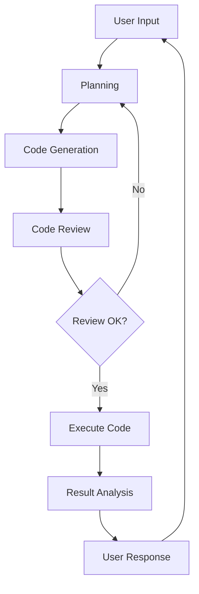

# Building Self-Reflective Agents with LangGraph

## Introduction
In this workshop, we'll learn how to build an AI agent that can analyze data, generate code, and most importantly, reflect on and improve its own performance. We'll use LangGraph, a powerful framework for building graph-based AI agents.

## What We'll Build
We're going to create an agent that can:
1. Understand user requests about data analysis
2. Plan the necessary steps to fulfill these requests
3. Generate and execute Python code
4. Review its own output and make improvements
5. Maintain a conversation with users about the results

## Key Components

### 1. State Management
```python
class State(TypedDict):
    messages: Annotated[list, add_messages]  # Track conversation
    code: str                                # Store generated code
    data: str                                # Hold analysis results
    source: str                              # Reference data sources
```

### 2. Core Agents
- **Planning Agent**: Designs analysis approach
- **Code Generation Agent**: Writes Python code
- **Review Agent**: Validates results
- **Analysis Agent**: Interprets results

### 3. Graph Structure


## Setup Requirements

1. **Environment Setup**
```python
# Required imports
from langchain_core.tools import tool
from langchain_core.messages import SystemMessage
from langchain_core.prompts import ChatPromptTemplate
from langgraph.graph import StateGraph, Graph
from typing import Annotated, TypedDict
```

2. **API Configuration**
```python
import os
from dotenv import load_dotenv

# Load environment variables
load_dotenv()

# Verify API keys
if not os.getenv("OPENAI_API_KEY"):
    raise ValueError("OpenAI API key not found!")
```

## Workshop Flow

### Part 1: Foundations (Current Section)
- Understanding graph-based agents
- Setting up the development environment
- Creating basic state management

### Part 2: Building Core Components
- Implementing agent nodes
- Setting up the graph structure
- Basic message flow

### Part 3: Advanced Features
- Self-reflection loops
- Error handling
- Performance optimization

## Getting Started

Before we begin, let's verify our setup:

```python
# Test environment
def test_environment():
    required_packages = [
        "langgraph",
        "langchain",
        "pandas",
        "pydantic"
    ]
    
    missing = []
    for package in required_packages:
        try:
            __import__(package)
        except ImportError:
            missing.append(package)
    
    if missing:
        print(f"Missing packages: {', '.join(missing)}")
        return False
    return True

# Run test
environment_ready = test_environment()
print(f"Environment ready: {environment_ready}")
```

## Example: Simple Agent Interaction

```python
from langchain_openai import ChatOpenAI

# Initialize LLM
llm = ChatOpenAI(
    model="gpt-4",
    temperature=0
)

# Basic agent response
response = llm.invoke([
    SystemMessage(content="You are a helpful data analysis assistant."),
    HumanMessage(content="What can you tell me about data analysis?")
])

print(response.content)
```

## Next Steps
In the following sections, we'll:
1. Set up our state management system
2. Create our first agent nodes
3. Build basic graph structure
4. Implement message handling

## Exercise: Basic Setup
1. Verify your environment is properly configured
2. Test basic LLM interaction
3. Create a simple state class
4. Implement basic message handling

## Resources
- [LangGraph Documentation](https://python.langchain.com/docs/langgraph)
- [LangChain Documentation](https://python.langchain.com)
- [Example Repository](https://github.com/example/repository)

## Notes
- Keep your API keys secure
- Monitor API usage
- Use version control for your code
- Document your progress

Would you like to proceed with the exercises?