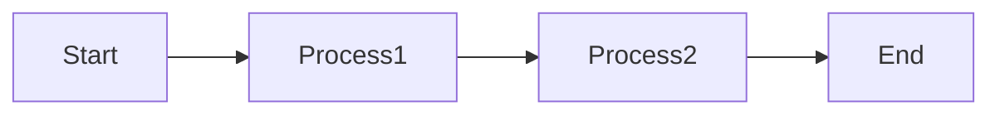
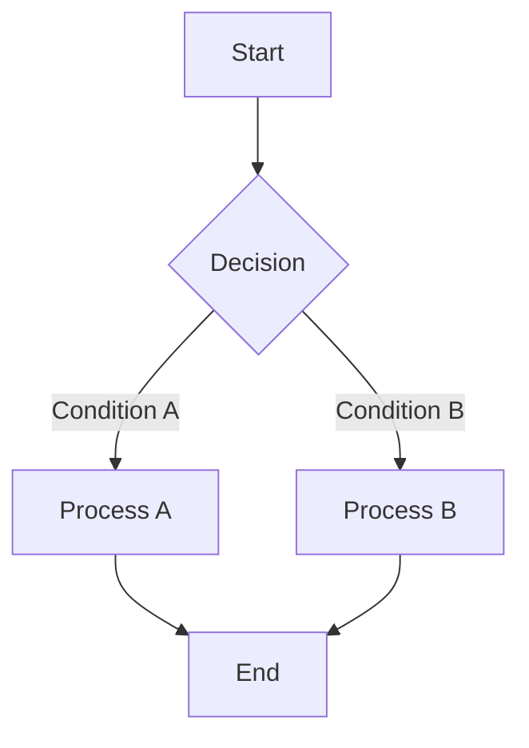
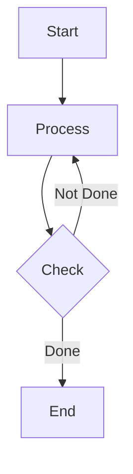

# Part 2: Understanding Graphs and Flows in LangGraph

## Introduction to Graph-Based Systems

### What is a Graph?
- Collection of nodes (vertices) and edges
- Nodes represent processing steps
- Edges represent flow of information
- Can have conditional paths and loops

### Why Use Graphs?
- Clear visualization of process flow
- Easy to modify and extend
- Natural way to handle complex logic
- Supports parallel processing

## LangGraph Components

### 1. StateGraph
Basic building block for creating graph-based applications.

```python
from langgraph.graph import StateGraph

# Define state structure
class State(TypedDict):
    messages: Annotated[list, add_messages]
    data: str
    
# Create graph
graph = StateGraph(State)
```

### 2. Nodes
Represent processing units in the graph.

```python
# Simple node function
def process_node(state: State):
    return {"messages": ["Processed data"]}

# Add node to graph
graph.add_node("processor", process_node)
```

### 3. Edges
Connect nodes and define flow.

```python
# Basic edge
graph.add_edge("node1", "node2")

# Multiple edges
graph.add_edges(
    "node1",
    ["node2", "node3"]
)
```

### 4. Conditional Routing
Direct flow based on conditions.

```python
def router(state: State):
    if condition:
        return "path_a"
    return "path_b"

graph.add_conditional_edges(
    "decision_node",
    router,
    {
        "path_a": "node_a",
        "path_b": "node_b"
    }
)
```

## Graph Patterns

### 1. Linear Flow


```python
# Implementation
graph.add_node("process1", step1_function)
graph.add_node("process2", step2_function)
graph.add_edge("process1", "process2")
```

### 2. Branching Flow


```python
def decision_router(state: State):
    if state["condition"]:
        return "process_a"
    return "process_b"

graph.add_conditional_edges(
    "decision",
    decision_router,
    {
        "process_a": "process_a_node",
        "process_b": "process_b_node"
    }
)
```

### 3. Cyclic Flow (Loops)


```python
def check_completion(state: State):
    if state["complete"]:
        return "end"
    return "process"

graph.add_conditional_edges(
    "check",
    check_completion,
    {
        "process": "process_node",
        "end": "end_node"
    }
)
```

## Practical Implementation

### Basic Data Processing Graph
```python
from typing import TypedDict, Annotated
from langgraph.graph import StateGraph

# Define state
class ProcessState(TypedDict):
    data: str
    processed: bool
    
# Define nodes
def load_data(state: ProcessState):
    return {"data": "loaded data"}

def process_data(state: ProcessState):
    return {"processed": True}

def check_processing(state: ProcessState):
    return "end" if state["processed"] else "process"

# Create graph
graph = StateGraph(ProcessState)

# Add nodes
graph.add_node("load", load_data)
graph.add_node("process", process_data)

# Add edges
graph.add_edge("load", "process")
graph.add_conditional_edges(
    "process",
    check_processing,
    {
        "process": "process",
        "end": END
    }
)
```

## Exercises

### Exercise 1: Create Simple Linear Graph
Build a graph that processes data in sequence:
1. Load data
2. Clean data
3. Analyze data

### Exercise 2: Implement Decision Router
Create a router that directs flow based on data characteristics:
- Numerical data → statistical analysis
- Text data → text analysis

### Exercise 3: Build Loop Structure
Implement a graph that processes data until a condition is met:
- Process chunks of data
- Check completion
- Continue or end based on status

## Best Practices

1. **State Management**
   - Keep state minimal but sufficient
   - Use clear naming conventions
   - Handle updates consistently

2. **Node Design**
   - Single responsibility principle
   - Clear input/output contracts
   - Error handling

3. **Flow Control**
   - Clear routing conditions
   - Handle all possible paths
   - Avoid infinite loops

4. **Testing**
   - Test individual nodes
   - Verify routing logic
   - Check end-to-end flows

## Common Patterns

1. **Validation Chain**
```python
START -> Validate -> Process -> Validate -> END
```

2. **Retry Loop**
```python
START -> Process -> Check -> (Retry/END)
```

3. **Parallel Processing**
```python
START -> Split -> (Process A/Process B) -> Merge -> END
```

## Next Steps
- Adding agent logic to nodes
- Implementing complex routing
- Handling external services
- Error recovery patterns

## Resources
- LangGraph documentation
- Graph theory basics
- Flow control patterns