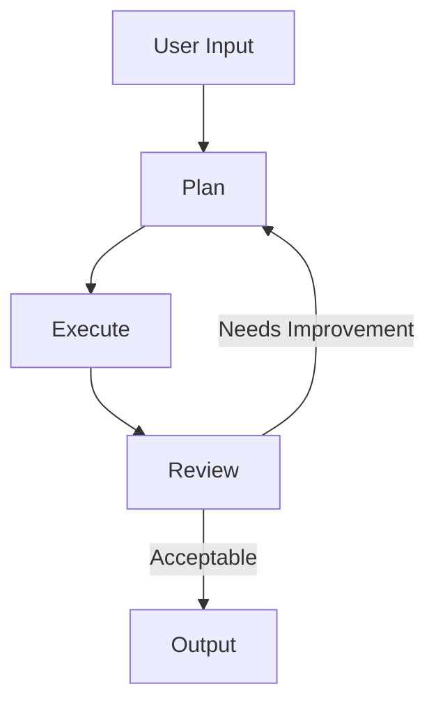

# Part 3: Loops and Agents in LangGraph

## Introduction
In this section, we'll combine agents with graph structures to create self-improving systems. We'll focus on:
- Agent implementation in graph nodes
- Feedback loops for self-improvement
- State management for complex agents
- Error handling and recovery

## Agent Types and Responsibilities

### 1. Planning Agent
```python
def planning_agent(state: State, llm: ChatOpenAI = llm):
    """Creates plans based on user requests."""
    system_prompt = """
    Based on the user request and context:
    1. Analyze the requirements
    2. Break down into steps
    3. Consider potential issues
    4. Create actionable plan
    """
    messages = [SystemMessage(content=system_prompt)] + state["messages"]
    response = llm.invoke(messages)
    return {"messages": [response]}
```

### 2. Execution Agent
```python
def execution_agent(state: State, llm: ChatOpenAI = llm):
    """Executes plans and generates code."""
    system_prompt = """
    Transform the plan into executable code:
    1. Follow the plan steps
    2. Generate appropriate code
    3. Include error handling
    4. Add documentation
    """
    messages = [SystemMessage(content=system_prompt)] + state["messages"]
    response = llm.invoke(messages)
    return {"code": response.content, "messages": [response]}
```

### 3. Review Agent
```python
def review_agent(state: State, llm: ChatOpenAI = llm):
    """Reviews outputs and suggests improvements."""
    system_prompt = """
    Review the output and decide:
    1. Is it correct? (#CORRECT/#INCORRECT)
    2. Are there improvements needed?
    3. What specific changes would help?
    """
    messages = [SystemMessage(content=system_prompt)] + state["messages"]
    response = llm.invoke(messages)
    return {"messages": [response]}
```

## Implementing Feedback Loops

### Basic Feedback Loop


### Loop Implementation
```python
# Router for feedback
def feedback_router(state: State):
    """Route based on review feedback."""
    last_message = state["messages"][-1].content
    if "#INCORRECT" in last_message:
        return "revise"
    return "complete"

# Graph structure
graph = StateGraph(State)
graph.add_node("plan", planning_agent)
graph.add_node("execute", execution_agent)
graph.add_node("review", review_agent)

# Add feedback loop
graph.add_conditional_edges(
    "review",
    feedback_router,
    {
        "revise": "plan",
        "complete": "output"
    }
)
```

## State Management for Loops

### State Structure
```python
class AgentState(TypedDict):
    messages: Annotated[list, add_messages]
    code: str
    history: List[Dict]
    iterations: int
    improvements: List[str]
```

### State Tracking
```python
def track_improvements(state: State):
    """Track improvements made during iterations."""
    return {
        "iterations": state.get("iterations", 0) + 1,
        "improvements": state.get("improvements", []) + [
            f"Iteration {state['iterations']}: {state['messages'][-1].content}"
        ]
    }
```

## Error Recovery Patterns

### Error Detection
```python
def detect_errors(state: State):
    """Detect errors in execution or output."""
    try:
        # Attempt execution or validation
        result = execute_code(state["code"])
        return {"success": True, "result": result}
    except Exception as e:
        return {
            "success": False,
            "error": str(e),
            "messages": [f"Error detected: {str(e)}"]
        }
```

### Recovery Routes
```python
def error_router(state: State):
    """Route based on error type."""
    if not state.get("success"):
        error_type = analyze_error(state["error"])
        return {
            "syntax": "fix_syntax",
            "logic": "fix_logic",
            "data": "fix_data"
        }.get(error_type, "plan")
    return "continue"
```

## Complete System Example

```python
from typing import TypedDict, Annotated
from langgraph.graph import StateGraph
from langchain_core.messages import SystemMessage, HumanMessage

class AgentState(TypedDict):
    messages: Annotated[list, add_messages]
    code: str
    result: str
    iterations: int
    success: bool

def create_agent_system():
    """Create complete agent system with feedback loops."""
    graph = StateGraph(AgentState)
    
    # Add core agents
    graph.add_node("plan", planning_agent)
    graph.add_node("execute", execution_agent)
    graph.add_node("review", review_agent)
    
    # Add error handling
    graph.add_node("error_check", detect_errors)
    
    # Add routing
    graph.add_conditional_edges(
        "review",
        feedback_router,
        {
            "revise": "plan",
            "complete": "output"
        }
    )
    
    graph.add_conditional_edges(
        "error_check",
        error_router,
        {
            "fix_syntax": "execute",
            "fix_logic": "plan",
            "fix_data": "plan",
            "continue": "review"
        }
    )
    
    return graph.compile()
```

## Exercises

### Exercise 1: Basic Loop
Implement a simple feedback loop with two agents:
- Generator agent creates content
- Reviewer agent provides feedback
- Loop until quality threshold met

### Exercise 2: Error Recovery
Create an error recovery system:
- Detect different types of errors
- Route to appropriate fix
- Track recovery attempts

### Exercise 3: Complete Agent
Build a self-improving agent that:
- Takes user requests
- Generates solutions
- Reviews its own work
- Improves based on feedback

## Best Practices

1. **Loop Control**
   - Set maximum iterations
   - Track improvement metrics
   - Have clear exit conditions

2. **State Management**
   - Keep history of changes
   - Track improvement patterns
   - Maintain context

3. **Agent Design**
   - Clear responsibilities
   - Consistent output format
   - Robust error handling

4. **System Integration**
   - Modular components
   - Clear interfaces
   - Comprehensive logging

## Next Steps
- Advanced routing patterns
- Multi-agent cooperation
- Performance optimization
- Memory management